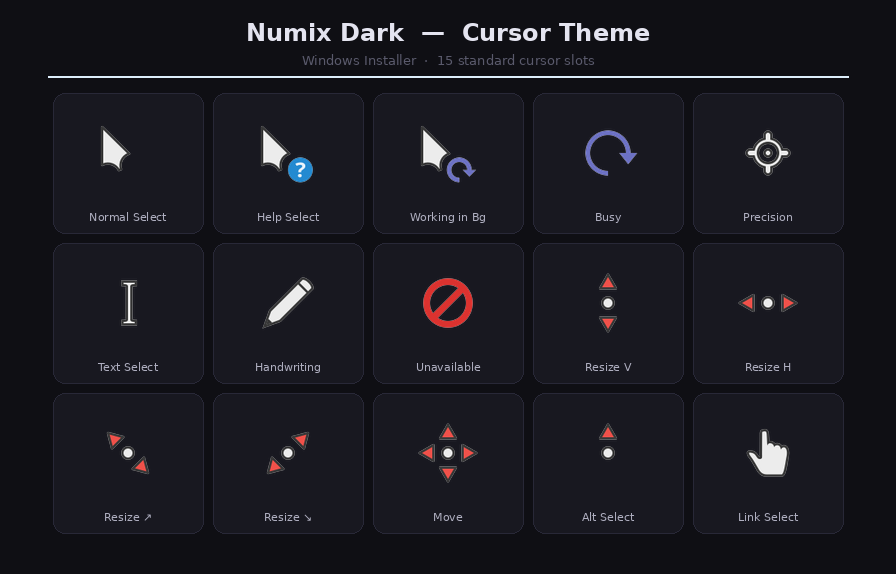
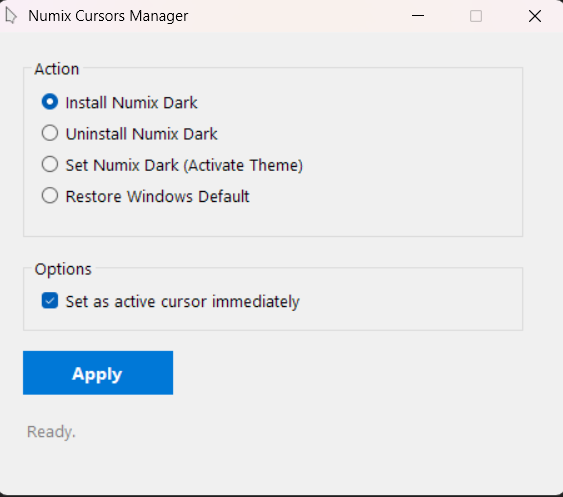

# NumixCursorTheme-WindowsInstaller (v1.2.2)

[](./LICENSE)
[](https://www.gnu.org/licenses/gpl-3.0.html)
[](https://github.com/KamalAraf/NumixCursorTheme-WindowsInstaller)
[](https://github.com/KamalAraf/NumixCursorTheme-WindowsInstaller/releases)

[](assets/preview.png)

> A dependency-free Windows installer for the Numix cursor theme.

This project is a **Windows-native port** of the original [numix-cursor-theme](https://github.com/numixproject/numix-cursor-theme) by the [Numix Project](https://github.com/numixproject).  
The original repository provides Linux-first tooling and requires additional dependencies to install the theme on Windows. This project eliminates that friction by packaging all cursor files alongside a native C# application — no extra software required.

---

## What's included

* **`NumixCursorsManager.exe`** — fully self-contained: all cursor files are embedded inside the exe, so **no ZIP or extra files are needed** to install the theme
* **Two cursor variants**, each covering the full Numix cursor set for Windows:
  * **Numix Cursor Dark** — white cursors for dark backgrounds
  * **Numix Cursor Light** — dark cursors for light backgrounds
* **13 static cursor files** (`.cur`) per variant, **2 animated cursor files** (`.ani`) per variant
* **`logo.ico`** — custom app icon (stored in `assets/`)
* **Source code** — C# source files (`Program.cs`, `MainForm.cs`), build script (`build.bat`), and cursor sources (`src/cursors/`)

---

## Screenshots

### Application Interface
[](assets/preview2.png)

---

## Installation

### Quick Start (Recommended)

> The release includes the precompiled `NumixCursorsManager.exe` — a single self-contained file. No ZIP, no other files, no build step required.

1. Download `NumixCursorsManager.exe` from the [Releases](https://github.com/KamalAraf/NumixCursorTheme-WindowsInstaller/releases) page
2. Double-click `NumixCursorsManager.exe` — UAC elevation is automatic
3. Select your preferred **cursor variant**: **Numix Cursor Dark** (for dark backgrounds) or **Numix Cursor Light** (for light backgrounds)
4. Select **"Install"**
5. (Optional) Check **"Set as active cursor immediately"** to apply the theme right away
6. Click **Apply**

The ZIP attached to the releases is a source-code archive only — it is **not required** to install the theme.

### Build from Source

1. Clone or download this repository
2. Open the `src/` folder
3. Run `build.bat` — it compiles `NumixCursorsManager.exe` with all 30 cursor files embedded as resources (using the .NET Framework C# compiler, preinstalled on Windows)
4. The compiled `NumixCursorsManager.exe` will appear in the `src/` folder

---

## Usage

The **Numix Cursors Manager** lets you pick a **Cursor Variant** (Dark or Light) and then perform one of four actions:

* **Install** — Copies static and animated cursor files to the system directory and registers the theme.
* **Set Active** — Activates the theme if already installed, without reinstalling.
* **Uninstall** — Removes the theme and all cursor files. Automatically restores the Windows default cursor if the theme is currently active.
* **Restore Windows Default** — Resets the cursor theme to Windows default. Skips the operation if the default is already active.

**Options:**
* **Pointer Size** (slider) — *Available during installation only.* Adjusts the size of the installed cursors (32px to 240px). The app dynamically generates cursor files to match the selected size. **Note: Cursors may appear blurry above 96px; this is a known issue.**
* **Set as active cursor immediately** (checkbox) — *Available during installation only.* When checked, applies the theme instantly after copying files. Uncheck to install without changing the active cursor.

---

## Compatibility

| Windows Version | Status |
| --- | --- |
| Windows 11 | Supported |
| Windows 10 | Supported |
| Windows 7 / 8 | Untested |

> **Windows 11 Note:** The *Location Select* and *Person Select* cursor slots introduced in Windows 11 cannot be themed through the standard cursor scheme mechanism and will remain as Windows defaults. All other cursor slots are fully supported.

---

## Project structure

```
NumixCursorTheme-WindowsInstaller/
├── src/
│   ├── cursors/
│   │   ├── dark/              # Numix Cursor Dark (white cursors)
│   │   │   ├── static/        # Static cursor files (.cur)
│   │   │   └── animated/      # Animated cursor files (.ani)
│   │   └── light/             # Numix Cursor Light (dark cursors)
│   │       ├── static/        # Static cursor files (.cur)
│   │       └── animated/      # Animated cursor files (.ani)
│   ├── Program.cs             # Application entry point
│   ├── MainForm.cs            # Main application logic and GUI
│   ├── build.bat              # Build script (embeds all cursor files into the exe)
│   └── app.manifest           # UAC manifest (requires administrator)
├── assets/
│   ├── logo.png               # Project logo
│   ├── logo.ico               # App icon — exe, taskbar, and form title bar
│   ├── preview.png            # Preview image for the README
│   ├── preview2.png           # App interface screenshot
│   └── social_preview.png     # Social preview image
├── LICENSE
└── README.md
```

---

## Changelog

### v1.2.3
* Added dynamic cursor resizing — choose any pointer size (32-240px) using a new slider in the GUI. The app now generates scaled cursor files on the fly during installation using a high-quality Lanczos resampling algorithm.
* Integrated with Windows system cursor size settings to apply and restore user preferences.

### v1.2.2
* Made `NumixCursorsManager.exe` fully self-contained — all 30 cursor files (13 static + 2 animated per variant) are now embedded in the exe as resources and extracted at install time. The exe works standalone: **no ZIP, no `cursors/` folder, no other files required**
* Added `src/build.bat` — one-click build script that compiles the exe with all embedded resources
* Release ZIP is now a source-code archive only (optional for installation)

### v1.2.1
* Fixed variant detection when uninstalling — `IsNumixActive` matched `Numix-Cursor-Light` files against the `Numix-Cursor` prefix, so uninstalling the dark variant while the light variant was active could restore the Windows default cursor and wipe the active scheme. The check now matches on the full directory path
* Fixed missing cursor files being silently ignored on activation — the missing-file check was computed and logged but never enforced, so `SetActiveCursor` proceeded and `SPI_SETCURSORS` failed with an unclear error. It now throws with the list of missing files (and a reinstall hint) before touching the registry
* Fixed silent failure on unopenable registry key in `SetActiveCursor` and `RestoreDefault` — instead of showing a false "Operation completed successfully", the app now throws an error message

### v1.2
* Added **Numix Cursor Light** variant — dark-colored cursors optimized for light backgrounds, selectable via the new **Cursor Variant** selector in the GUI
* Renamed the original variant to **Numix Cursor Dark** for clarity
* Regenerated all cursor files in native Windows DIB format (32-bit BGRA + AND mask) — the previous PNG-based `.cur` files and legacy `.ani` files failed to load on some Windows systems, causing `SystemParametersInfo(SPI_SETCURSORS)` to report "cursor files not found". All 26 `.cur` + 4 `.ani` files are now verified to load correctly
* Fixed cursor activation failing on systems where `SPI_SETCURSORS` returned an error with `SPIF_UPDATEINIFILE` — the installer now persists the registry values itself and activates via `SPIF_SENDCHANGE` only
* Added `numix-install.log` diagnostic logging (created next to the exe) that records every step: file copies, registry writes, and the result of the activation call

### v1.1.3
* Fixed hotspot alignment on 5 cursor files (`default`, `help`, `pencil`, `pointer`, `up-arrow`) — hotspot coordinates were misaligned with the actual tip of each cursor image (fix by [SorenINT2000](https://github.com/SorenINT2000))
* Fixed `INSTALL_DIR` hardcoded to `C:\Windows` — now resolves dynamically, fixing installation on systems where Windows is installed on a drive other than C:
* Fixed null reference on `CreateSubKey` — added explicit null check with a descriptive error message when the registry key cannot be created
* Fixed redundant `ResetUI()` calls in early-return paths — the method was being called twice on every early exit due to the `finally` block also calling it
* Fixed missing success confirmation when installing via the "Set Numix Dark" prompt — the dialog would complete silently without showing "Operation completed successfully"

### v1.1.2
* Fixed cursor hotspots shifted on all 13 static cursor files — hotspot values were being scaled proportionally during HiDPI upscaling instead of being set to their correct positions (arrow tip, center, hand tip, etc.). All 78 hotspot entries across 6 sizes per file have been corrected
* Fixed `ResetUI()` not resetting the status label — in some early-return paths (e.g. clicking "No" on a confirmation dialog) the label would remain stuck on "Processing..."
* Fixed `SystemParametersInfo` return value never being checked — if the call failed silently, the app would show "Operation completed successfully" while the cursor remained unchanged. It now throws with a descriptive message
* Removed 88 unused static cursor files (Linux/X11 aliases not referenced by the installer) and 6 duplicate animated cursor files — reduced cursor count from 101 static + 8 animated to 13 static + 2 animated
* Renamed `SPIF_UPDATE` constant to the correct `SPIF_UPDATEINIFILE | SPIF_SENDCHANGE` for clarity

### v1.1.1
* Removed 15 Linux-only cursor files unused on Windows (X11/Wayland aliases) — reduced static cursor count from 101 to 86
* Fixed icon handle leak in `LoadAppIcon()` — now uses `using` + `Clone()` to release the file stream immediately after load

### v1.1
* Replaced `.inf` + `uninstall.bat` with a native C# Windows Forms application (`NumixCursorsManager.exe`)
* Added GUI with four operations: Install, Uninstall, Set Active, Restore Default
* Added automatic UAC elevation via `app.manifest` — no manual "Run as administrator" required
* Added instant cursor application via `SystemParametersInfo` — no reboot or logout required
* Added detection of already-installed or already-active state before each operation
* Upscaled all cursor files to 256×256 with HiDPI sizes (32, 48, 64, 96, 128, 256 px) for crisp rendering on high-resolution displays

### v1.0
* Initial release — `.inf`-based installer with `uninstall.bat`
* Bundled 101 static and 8 animated Numix Dark cursor files

---

## Credits

All cursor artwork is part of the **Numix cursor theme**, originally created by the [Numix Project](https://github.com/numixproject) and distributed under the GPL-3.0 license.

This installer wrapper is a convenience repackaging for Windows users. Cursor files have been repackaged for Windows compatibility in native `.cur`/`.ani` format; the visual artwork has not been altered.

* Original project: <https://github.com/numixproject/numix-cursor-theme>
* Numix Project: <https://github.com/numixproject>

---

## License

The **installer wrapper** (C# source code, manifest, project structure, and documentation) is licensed under the [Installer Wrapper License](./LICENSE).  
The **cursor assets** (`.cur`, `.ani`) retain their original [GPL-3.0](https://www.gnu.org/licenses/gpl-3.0.html) license from the Numix Project.